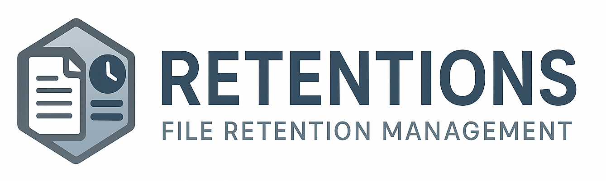

<p align="left">
  
</p>

## retentions

A small, feature-rich cross-platform CLI tool to apply backup-style retention rules to any file set. 

It remains only the most recent or representative files according to simple time-based rules and deletes the rest.

```bash
retentions /data/backups '*.tar.gz' -d 7 -w 4 -m 6   # Keeps last 7 days, 4 weeks and 6 months
```

It is a safe alternative to ad-hoc cleanup scripts for backups, archives, and artifacts.

[](LICENSE)
[](https://github.com/tkn777/retentions/releases)
[]()
[](https://codecov.io/gh/tkn777/retentions)

---

## 📌 Why `retentions` exists

Retention is rarely the problem — implicit deletion usually is.

- How do we make retention decisions auditable and reproducible?
- Why do time-based cleanup scripts so often delete the *wrong* backups?
- How can deletion decisions be explained, reviewed, and justified later?

`retentions` was built to answer these questions with explicit rules instead of implicit assumptions — treating retention as policy expressed in code.

---

## 🌐 Overview  

`retentions` is a single-file Python script that applies retention logic to a directory of files. 

It groups files into time **buckets** (hours, days, weeks, months, quarters, years) and retains only one representative file per bucket, typically the most recent one. Additionally it retains the **last N files** regardless of age.

And filters can be used to reduce the retention scope to a subset of files.

Everything outside your defined retention scope is deleted (unless `--dry-run` or `--list-only` is used).

⚠️ **Warning:** This tool permanently deletes files outside the defined retention scope.  
Use `--dry-run` first to verify behavior. The author assumes no liability for data loss.

It is intended for administrators who understand retention concepts and want deterministic, scriptable behavior.

---

## ❕ Folder mode semantics

When `--folder-mode` is enabled (see [Folder Mode](#-folder-mode---folder-mode) ), **all references to 'files' in this whole documentation in this project refer to 'folders' instead**.

---

## ⚙️ Features

- Pure **Python 3**, no external dependencies.  
- Runs on **Linux, macOS, and Windows** (and anywhere else Python 3 runs).  
- Supports **hourly, daily, weekly, monthly, quarterly, yearly** retention buckets.  
- Supports **keeping the last N files** (`--last`) regardless of age.  
- Supports **filtering (max-age, max-size, max-files)** to reduce the retention scope to a subset of files.
- Supports **protecting files** against deletion.
- Supports **regex or glob** pattern matching.  
- Safe modes:  
  - `--dry-run` → simulate actions  
  - `--list-only` → output only files that would be deleted  
- Usage:
  - `--help` (also described below in this document)
- Version:
  - `--version`
- Clean, deterministic output - ASCII only, no colors, no locales.

---

## 🧠 Logic Summary

### Logic
1. Scan all files
2. Ignore all protected files (for the whole process)
3. Retain (or not) by time-based buckets (--hours, --days, --weeks, --months, --years, --quarter, --week13)
4. Retain by --last (latest N files)
5. Filtered (everything retained before) by 
    1. --max-age (strict time cutoff)
    2. --max-files (upper limit by file count)
    3. --max-size (upper limit by total storage)
6. Delete files or list files to delete
7. If `--dry-run` is enabled, print the planned actions instead of executing them.

In this document, "retain" refers to the selection process, while "keep" refers to the resulting decision on individual files.

---

## 🧱 Non-goals

`retentions` is intentionally **not** designed to:
- perform recursive directory traversal
- act as a full backup solution
- manage retention across multiple directories
- provide interactive safety prompts

---

## 🧰 Installation

You can install **retentions** in several ways, depending on your system and preference.

*All installation methods require **Python 3.9+** *(tested against Python 3.9-3.14)*.\
No dependencies beyond Python 3.*


### 🧩 Option 1 – Debian Package (.deb)

Download the latest `.deb` package from the [Releases](https://github.com/tkn777/retentions/releases) page and install it manually:

```bash
sudo dpkg -i retentions_x.y.z_all.deb
```

This installs:
- `/usr/bin/retentions`
- documentation in `/usr/share/doc/retentions/`
- `man` page
- shell completion for `bash` and `zsh`

#### 🗄️ Debian Repository

You can use the Debian repository provided by `thk-systems.net` to receive automatic updates:

```bash
curl -fsSL https://debian.thk-systems.net/repo-install.sh | sudo sh
sudo apt install retentions
```

### 📦 Option 2 – Redhat Package (.rpm)

Download the latest `.rpm` package from the [Releases](https://github.com/tkn777/retentions/releases) page and install it manually:

```bash
sudo dnf install retentions-x.y.z-n.noarch.rpm # or with yum
```

This installs:
- `/usr/bin/retentions`
- documentation in `/usr/share/doc/retentions/`
- `man` page
- shell completion for `bash` and `zsh`

### 📦 Option 3 – Self-installing .tar.gz for linux

Download the latest `.linux-installer` package from the [Releases](https://github.com/tkn777/retentions/releases) page and install it manually:

```bash
sudo bash install retentions-x.y.z.linux-installer
```

This installs:
- `/usr/local/bin/retentions`
- documentation, `man` page and shell completion in `/usr/local/share/...`

### 🗜️ Option 4 – Universal (tar.gz / zip)

For non-Debian-based or non-Redhat-based systems:

Download the latest `retentions-x.y.z.tar.gz` or `retentions-x.y.z.zip` package from the [Releases](https://github.com/tkn777/retentions/releases) page and install it manually

The archive includes:
- the common Python script: `retentions.py`
- a common linux variant with shebang: `linux/retentions`
- a macOS variant with shebang: `macos/retentions`
- and all the docs: `docs`
- and the shell completions for `bash` and `zsh`

### 🔍 To verify installation:

```bash
retentions --help
```

---

## 🖥️ Usage

```bash
python3 retentions.py <path> <file_pattern> [options]
```

*If you installed via .deb or .rpm or a shebang'ed version from the tar.gz / zip, you can simply run `retentions` instead of `python3 retentions.py`.*

---

## 🔧 Arguments and Options

| Arguments | Description |
|--------|--------------|
| `path` | base directory to scan |
| `file_pattern` | glob pattern for matching files (use quotes to prevent shell expansion) |

⚠️ `path` and `file_pattern` are mandatory
&nbsp;

| Flag | Description |
|--------|--------------|
| `-r, --regex [mode]` | file_pattern / protect is a regex (otherwise: glob pattern) - mode: casesensitive (default), ignorecase |
| `--age-type [time]` | Used time attribute for file age - time: ctime, mtime (default), atime, birthtime |
| `--protect <pattern>` | Protect files from deletion (using regex or glob, like file_pattern) |
| `--folder-mode` | Use folders instead of files in `path`: You need to specify the mode, to get the xtime of the folder: folder, youngest-file (default), oldest-file, path=<path>), youngest-|oldest-file are recursive within the folder |

⚠️ `age-type`: 
- `ctime` is platform-dependent: e.g. Windows => create-time, Linux => change time of meta data
- `atime` may not reliable, check your platform, your filesystem and your mount options
- `birthtime` may not available on your platform or your filesystem
- ❗`retentions` checks the availability of the selected `age-type`, but not the semantic

💡 See section [Folder Mode](#-folder-mode---folder-mode) for details about `--folder-mode`
&nbsp;

| Retention options | Description |
|--------|--------------|
| `-h, --hours <int>` | Retain one file per hour from the last N hours |
| `-d, --days <int>` | Retain one file per day from the last N days |
| `-w, --weeks <int>` | Retain one file per week from the last N weeks |
| `-m, --months <int>` | Retain one file per month from the last N months |
| `-q, --quarters <int>` | Retain one file per quarter from the last N quarters (quarter by months) |
| `--week13 <int>` | Retain one file per 13-week block from the last N 13-week blocks (quarter by weeks) |
| `-y, --years <int>` | Retain one file per year from the last N years |
| `-l, --last <int>` | Always retains the N most recently modified files |
| `-i, --skip-by-filesize <size>` | Skip (and delete) files smaller than <size> (e.g. 12, 2K, 1.5M) |

📝 Every retention option can be combined with any (or all) others
&nbsp;

🧠 Logic:
- The retention periods are applied cumulatively. For example, a file that is marked as keep with the retention `--days` **cannot** be marked as keep with the retention `--week`.
- Retention buckets are hierarchical. Coarser buckets only select data strictly older than all finer-grained selections
- One exception here is `--last`. It always marks the last `N` files as retained, regardless of all other retentions.
- If no retention period are specified all files are retained (and may be filtered)
&nbsp;

| Filter options | Description |
|--------|--------------|
| `-s, --max-size <size>` | Keep maximum within total size (e.g. 12, 10.5M, 500G, 3E) |
| `-f, --max-files <count>` | Keep maximum total files |
| `-a, --max-age <age>` | Keep maximum within time span N from script start (e.g. 3600, 1h, 1d, 1w, 1m, 1q, 1y) |

📝 Every filter option can be combined with any (or all) others
&nbsp;

🧠 Logic:
- Filters apply after retention and may delete files previously marked to keep. (Use `--verbose debug` and `--dry-run` to see decision history.)
&nbsp;

| Behavior options | Description |
|--------|--------------|
| `-L, --list-only [separator]` | Output only file paths that would be deleted (incompatible with --verbose, separator defaults to '\n') |
| `-V, v, --verbose <int>` | Verbosity level: 0 = error, 1 = warn, 2 = info, 3 = debug (default: 'info', if specified without value; 'error' otherwise; use numbers or names) |
| `-X, --dry-run` | Show planned actions but do not delete any files |
| `--no-lock-file` | Omit lock file (default: enabled) |
| `--fail-on-delete-error` | Fails and exits if a file could not be deleted (default: disabled and print warning) |

💡 Using `--dry-run` is a good option to start with `retentions` 😏
&nbsp; 

| Expert options | Description |
|--------|--------------|
| `--delete-companions [rules]` | Delete companion files defined by the rules (prefix\|suffix:match:companions, e.g. 'suffix:tar.gz:sha256,md5') |

💡 See section [Delete Companions](#-delete-companions---delete-companions) for details
&nbsp;

| Developer options | Description |
|--------|--------------|
| `--stacktrace` | Add output of stacktrace in case of errors |

📝 For developers only
&nbsp;

| Common arguments | Description |
|--------|--------------|
| `-H, --help` | Show the help / usage of `retentions` |
| `-R, --version` | Show the version of `retentions` |

💡 Common arguments can be used without any other arguments.

---

### 🧾 Examples & further notes

#### Retentions & Filters

```bash
# Retain last 7 days, 4 weeks, 6 months
python3 retentions.py /data/backups '*.tar.gz' -d 7 -w 4 -m 6
```

```bash
# Keep daily/weekly/monthly backups, but retain at most 10 files in total.
# Older retained files are deleted if the limit is exceeded.
python3 retentions.py /data/backups '*.tar.gz' -d 7 -w 4 -m 6 --max-files 10 --dry-run
```

```bash
# Keep up to 12 monthly backups, but limit total retained size to 50 GB.
# Older retained files are deleted once the size limit is exceeded.
python3 retentions.py /data/backups '*.tar.gz' -m 12 --max-size 50G --dry-run
```

#### Dry run (no deletion)

```bash
python3 retentions.py /data/backups '*.tar.gz' -d 10 -w 3 -m 6 --dry-run
```

#### List-only mode (for piping into other tools)

```bash
python3 retentions.py /data/backups '*.tar.gz' -d 5 -w 12 --list-only '\0' | xargs -0 rm
```
⚠️ This bypasses retentions' own deletion **safety mechanisms**. Use with care!

#### Verbose output

```bash
# Detailed logging
python3 retentions.py /data/backups '*.tar.gz' -d 3 -w 1 --verbose debug
```

#### 🗓️ Hierarchical calendar-based retention example

Retention levels are applied hierarchically by calendar containment, not additively by age.

Each coarser-grained retention level only selects data strictly *outside* the
calendar range already covered by finer-grained levels.

Example:

```
-d 1 -w 1 -m 1
```

Assume the most recent retained day is: `2026-01-31`

This day lies in:
- calendar week **2026-W05**
- calendar month **2026-01**

Retention selection therefore proceeds as follows:

- **Days (`-d 1`)**
  - keep: `2026-01-31`

- **Weeks (`-w 1`)**
  - select a week *before* calendar week `2026-W05`
  - the week containing the retained day is excluded
  - the first eligible week is **2026-W04**

- **Months (`-m 1`)**
  - select a month *before* calendar month `2026-01`
  - the month containing the retained week is excluded
  - the first eligible month is **2025-12**

If no data exists in these older calendar buckets, no additional items are kept.

This hierarchical approach ensures that:
- finer-grained retention always takes precedence,
- coarser-grained retention never overlaps with finer levels,
- and each retention level contributes unique temporal coverage.
&nbsp;

```text
Time ──────────────────────────────────────────────────────────────▶

Month:   2025-12        |        2026-01
         [ eligible ]   | [ excluded by weeks ]
                         ┌──────────────────────-─────────┐
Week:                    │   2026-W05  (excluded)         │
                         │   2026-W04  ← selected (weeks) │
                         └─────────────────────-──────────┘
Day:                                   2026-01-31 ← selected (days)
```

---

### 📁 Folder mode (`--folder-mode`)

By default, `retentions` applies retention rules only to files.
With `--folder-mode`, retention rules are applied to **directories instead**.

Only **top-level directories** in the base directory are considered.
Subdirectories are never selected as retention objects.

The age of a directory is determined by one of the following time references:

- `youngest-file` (default):  
  Uses the most recent file inside the directory (recursive).

- `oldest-file`:  
  Uses the oldest file inside the directory (recursive).

- `folder`:  
  Uses the directory’s own timestamp (`mtime`, `ctime`, etc.).

- `path=<path>`:
  Uses the given file's timestamp

Empty directories are ignored (with a warning).
Recursive traversal is used only to determine a directory’s age.

---

### 🔗 Delete Companions (`--delete-companions`)

Deletes *companion files* together with a file being removed (e.g. checksum or metadata files).

#### Rule-Definition

```
TYPE:MATCH:COMPANIONS
```

- `TYPE`: `suffix` or `prefix`
- `MATCH`: prefix or suffix to match (may be empty → always matches)
- `COMPANIONS`: comma-separated replacements

#### Rule-Examples:

```
--delete-companions "suffix:.tar:.md5,.info" 
# Deletes `archive.md5` and `archive.info` when deleting `archive.tar`.

--delete-companions "suffix::.bak" "suffix::.tmp" 
# Deletes `file.txt.bak` and `file.txt.tmp` when deleting `file.txt`.

--delete-companions "prefix:backup-:meta-" 
# Deletes `meta-data.tar` when deleting `backup-data.tar`
```

#### Notes

- Only existing regular files are deleted.
- Companion paths are deduplicated.
- Protected or otherwise disallowed companions abort deletion (e.g. files marked as kept or pruned).
- Rules must be quoted.

---

### ➡️ Symbolic links

Symbolic links are intentionally **not supported**.

All paths must refer to real filesystem objects.  

This restriction ensures a strict, predictable retention scope and avoids ambiguous or hard-to-reason-about filesystem behavior.

---

### ⚠️ Quoting File Patterns

Always **quote your file patterns** (and companion rules) when calling `retentions`.

If you omit the quotes, your shell (e.g. Bash, Zsh, PowerShell) will expand the pattern **before** it reaches the program, resulting in unexpected arguments or errors.

#### ✅ Correct
```bash
python3 retentions.py /data/backups '*.tar.gz'
python3 retentions.py /data/logs 'log-*.txt'
python3 retentions.py /data/temp '.*\\.bak'
```

#### ❌ Incorrect
```bash
python3 retentions.py /data/backups *.tar.gz
```
(your shell expands *.tar.gz before retentions runs)

retentions itself handles pattern matching internally using glob or regex, so quoting ensures the pattern is passed as intended.

--- 

### ⚡ Exit Codes

| Code | Meaning |
|------|----------|
| 0 | Execution successful |
| 1 | I/O or filesystem error |
| 2 | Invalid or conflicting arguments |
| 5 | Concurrency error |
| 7 | Integrity check failed |
| 9 | Unexpected error |


---

### 💡 Tip

Use `--list-only` to integrate with external scripts or pipelines:

```bash
python3 retentions.py /data/logs '*.log' -d 3 -w 2 --list-only | while read f; do
    echo "Would delete $f"
done
```

---

## 🧭 Known Issues & Trade-offs

The following behaviors are known, intentional trade-offs rather than bugs.

- Retention option `months`, `quarters` and `years` are truly months, quarters and years, but filter options are 
  - `xm` => x * 30 days
  - `xq` => x * 90 days
  - `xy` => x * 365 days

---

### ~~☢️~~ Non-atomic behavior

retentions does not operate atomically. Since the underlying filesystem is not atomic, directory contents may change while retentions is scanning or evaluating files.
This can lead to inconsistent or incorrect results if the target path is modified concurrently.
If you require a strictly consistent state, ensure that the directory is not modified during execution.

By default retentions writes a lock file `.retentions.lock` - This can be used by other tools.

---

## 🛠️ Troubleshooting

- No files are deleted: Check retention options and filters, and use `--verbose debug --dry-run`.
- Unexpected deletions: Review the decision log output (`--verbose debug`).
- Script aborts early: Check exit codes and error messages.

---

## 🪨 Project Status

retentions is a deliberately small, complete tool.

Its feature set is stable and sufficient for its intended purpose.
Future changes will primarily consist of bug fixes, portability improvements, or documentation updates.

A low commit frequency is therefore a sign of maturity, not abandonment.

---

## 🪶 License

MIT License  
Copyright © 2025-2026 Thomas Kuhlmann

---

## 🐈‍⬛ Dedication

This project is dedicated to 'Motzli' - my real-life companion and friend. To that quiet, resilient cat whose presence still lives within me and keeps me standing up, no matter how often life burns everything down to ashes. For the strength, the gentleness, and the stubborn hope that never leaves - and will never be forgotten.

---

Simple. Predictable. Cross-platform.  
Just **retentions**.
